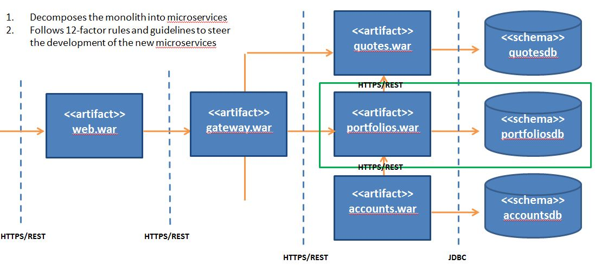

# Portfolios Microservice

	The APIs to the portfolios business functions

## Current State Architecture

DayTrader is multi-tier application built around the paradigm of an online stock trading system. Example business functions include
login, register, view portfolio, lookup stock quotes, and buy or sell stock. DayTrader was originally developed by IBM and donated 
to the Apache Geronimo community in the 2005 timeframe. The DayTrader architecture is representitive of monolithic applications that 
many businesses are still using. For that reason, we selected it to clarify the techniques for refactoring a monolith to microservices. 
For the original monolithic architecture, see http://geronimo.apache.org/GMOxDOC30/daytrader-a-more-complex-application.html. 

## Target State Architecture

### Portfolios Application

The Portfolios Application(highlighted in the green box) is a Spring Boot Application responsible for managing user portfolios

#### Static Viewpoint

#### Dynamic Viewpoint

#### Participant and Responsibilities

### Portfolios Database

The Portfolios Database(highlighted in the green box) stores user portfolio information. 

Note: attributes not directly related to portfolios are struck through in the diagram.

## Prerequisites

### Installation

#### For building Docker images and pushing them to a Docker registry

		1.	Inatall Java Development Kit (64 bit) 1.8+
		2.	Install Apache Maven 3.3.9+
		3.  Create DockerHub Account (https://hub.docker.com/)
		4.  Install Docker (https://www.docker.com/get-docker)
		
#### For deploying and managing applications on Kubernetes

		1.  Install kubectl (https://kubernetes.io/docs/tasks/tools/install-kubectl/)

#### For running Kubernetes on Minikube 

		1.  Install Minikube (https://kubernetes.io/docs/setup/minikube/)

#### For running Kubernetes on Amazon EKS

		1.  Create AWS Account (https://aws.amazon.com/premiumsupport/knowledge-center/create-and-activate-aws-account/)
		2.  Install AWS IAM Authenticator (https://docs.aws.amazon.com/eks/latest/userguide/configure-kubectl.html)
		2.  Install AWS Command Line Interface (https://docs.aws.amazon.com/cli/latest/userguide/installing.html)
		3.  Install eksctl (https://github.com/weaveworks/eksctl)

### Configuration

#### Maven

        The following settings are required for Maven to push Docker images to you DockerHub account

        1.  Change the following property in daytrader-portfolios/pom.xml to your DockerHub user name:
    
            <docker.image.prefix>${user.name}</docker.image.prefix>
               
        3.  Change the following key-value in daytrader-portfolios/env/external/k8s/portfolios-deployment.yaml to your DockerHub user name
        
            image: YOUR_DOCKERHUB_USERNAME/daytrader-gateway:4.0.18
        
        4.  The following property in daytrader-portfolios/pom.xml is also worth noting. You do not have to change it, but if you do, change the above key-value accordingly.
        
    		<tag>4.0.18</tag>
        
        5.  Add the following settings to your Maven ~/.m2/settings.xml so Maven can push images to your DockerHub account

                <servers>
                  <server>
                        <id>docker.io</id>
                        <username>YOUR_DOCKERHUB_USERNAME</username>
                        <password>YOUR_DOCKERHUB_PASSWORD</password>
                    </server>
                </servers>       
   
        

#### AWS CLI

        1.  Configuring the AWS CLI (https://docs.aws.amazon.com/cli/latest/userguide/cli-chap-getting-started.html)

                
                
#### Kubernetes Cluster

        1.  You must have at least one Kubernetes cluster.

                a.  For Minikube,
        
                    $ minikube --memory 8192 --cpus 2 start
            
                    ## Minikube comes with a cluster. It was running out of memory so increased to 8GB of RAM. You may be able to run with less RAM, but that setting worked well.
            
                b.  For EKS, 
        
                    $ eksctl create cluster --name=user116-eks-cluster --region=us-east-1
            
                    ## This command creates an EKS cluster named user116-eks-cluster in the us-east-1 region. For additional details on parameters, see https://github.com/weaveworks/eksctl
            
        2.  If you installed Minikube and Amazon EKS, then you will have two contexts in your ~/.kube/config file. One of those contexts is for accessing the Minikube
            cluster; the other context is for accessing the EKS cluster. You must set the context to the cluster before running kubectl commands. Set the context once
            then all subsequent kubectl commands will be directed to that cluster. Set it again and the kubectl commands will go to the other cluster. To do that,
                  
                a.  For Minikube, 
                
                    $ kubectl config use-context minikube
                        
                b.  For Amazon EKS, 
                
                    $ kubectl config use-context user116-eks-cluster  ## Use the name of your Amazon EKS cluster

        3.  Now you can verify your cluster by running some kubectl commands
        
                a.  For Minikube
        
                    $ kubectl config use-context minikube
                    
                    Switched to context "minikube".

                    $ kubectl cluster-info
                    
                    Kubernetes master is running at https://192.168.99.100:8443
                    KubeDNS is running at https://192.168.99.100:8443/api/v1/namespaces/kube-system/services/kube-dns:dns/proxy
                        
                b.  For Amazon EKS,
        
                    $ kubectl config use-context user116-eks-cluster  ## Use the name of your Amazon EKS cluster
                    
                    Switched to context "user116-eks-cluster".
            
                    $ kubectl kubectl cluster-info
                    
                    Kubernetes master is running at https://8D36DB7CBD2E3394FF0843CEA0C0A266.sk1.us-east-1.eks.amazonaws.com
   

## Delivery Pipeline

### Build Automation

		1.	cd daytrader-portfoliosapp
		2.	mvn clean install

### Continuous Integration

		1.	cd daytrader-portfoliosapp
		2.	mvn -Pci clean install

### Continuous Delivery

    Many of these manual steps can be automated by maven at a later date.
    

#### Create the Docker image and push it to DockerHub

        1.	$ cd daytrader-portfoliosapp
	    2.	$ mvn -Pcd clean install
		
	
#### Configure kubectl to access the right cluster
    
        1.  For Minikube,  
        
            $ minikube --memory 8192 --cpus 2 start
        
            $ kubectl config use-context minikube   
        
        2.  For EKS, 
        
            $ kubectl config use-context eks
            
            
#### Create the deployment, replica set, and pod(s) to run the application

	    1.  $ cd daytrader-portfoliosapp\daytrader-portfolios\env\external\k8s
    
		2.	$ kubectl apply -f portfolios-deployment.yaml 
		
		3.  $ kubectl get pods -o wide
		
		    ## Take note of the POD_NAME, and wait until the STATUS is Running.
              
        4.  $ kubectl logs {POD_NAME}
        
            ##  You should see : Tomcat started on port(s): 1443 (https)
        
        
        
#### Create the service so clients can communicate with pods via a constant IP

        Before creating the service it is important to understand that rationale for creating them. Remember that pods are ephemeral. If 
        a pod dies, then Kubernetes may create an identical pod but the pod will have a different IP. This means that clients should not 
        communicate with pods via the pod IP. Instead you should frontend all pods by a service, and clients should communicate with pods 
        through the service IP. 
        
        To create the service,

            1.  $ apply -f portfolios-service.yaml
        
            2.  $ kubectl get services
        
                NAME                     TYPE        CLUSTER-IP       EXTERNAL-IP   PORT(S)         AGE
                daytrader-portfolios     ClusterIP   10.100.17.24     <none>        443/TCP         3d
       
                ## Notes
        
                a.  The above command creates a service proxy. The service proxy listens on the CLUSTER IP and PORT. It is backed by endpoints 
                    to one or more pods. When the service proxy receives an HTTPS request, it selects one of the endpoints (pods) and forwards 
                    it to the pod. The application running in the pod handles the request and returns an HTTPS response
            
                b.  There is no EXTERNAL-IP to the service. This means that you can't access this service from outside the cluster. You can only 
                    access it from inside the cluster or from another component that resides inside the cluster. These options will be described 
                    below
        
        To access the service from inside the cluster,
            
            1.  $ kubectl get pods
        
                # Note the NAME of the portfolios pod; you'll need it to execute the next command
        
            2.  $ kubectl exec <POD_NAME> -it - curl -k https://<CLUSTER-IP>/health
        
            -- OR --
            
                $ kubectl exec <POD_NAME> -it - curl -k https://<SERVICE_NAME>/health
            
            ## Notes
        
                a.  These 'curl' commands don't work if you run them in the portfolios pod on Minikube. If you run them on another POD, they do work.
        
                b.  These commands instruct Kubernetes to execute the "curl" command inside the container of one of the pods. Curl then sends an HTTPS 
                    request to the service IP; which is backed by one of more pods. The service proxy selected a random pod and forwarded the request 
                    to it. The application running inside the pod handled the request, and an HTTPS response indicating that it is "UP".  
            
        To access the service from outside the cluster, using the API server
                        
            1.  $ kubectl proxy
        
                Starting to serve on 127.0.0.1:8001
                
                ## Takes care of locating and authenticating to the API server.

            2.  $ curl -k http://localhost:8001/api/v1/namespaces/default/services/https:daytrader-portfolios:/proxy/health
        
                ## The above command accesses the portfolios service through the API Server.

        See also https://kubernetes.io/docs/concepts/services-networking/service/

      
### Troubleshooting
        
    Review the standard output from your application using your pod names
    
        $ kubectl logs {POD_NAME} -f
        
        ## The -f option tails the logs
                
    Open a bash terminal using your pod names

        $ kubectl exec -ti {POD_NAME} bash
        # echo $SERVER_PORT    ## you should see 1443
        # exit
   

## API Endpoints 

### Swagger UI Documentation

	To see the API documentation, 

		1. Start the application

			a.	cd daytrader-portfoliosapp
			b. 	daytrader-portfolios\env\external\bin\start_server

		2. 	Point you browser to https://localhost:3443/swagger-ui.html

		3.	Stop the application after reviewing the APIs

			a.	cd daytrader-portfoliosapp	
			b.	daytrader-portfolios\env\external\bin\stop_server

